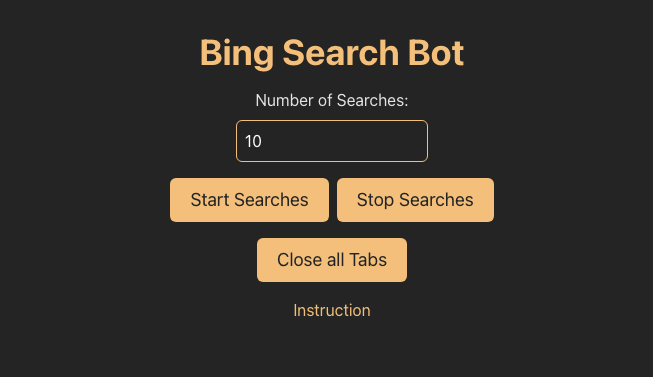
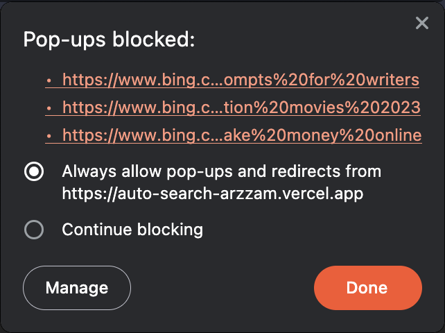

# Bing Search Bot

Bing Search Bot is a simple web application built using React that automates Bing searches based on random search queries. Users can specify the number of searches. The application opens new tabs in the browser, performs Bing searches with random queries, and allows users to stop the searches and close all opened tabs.


## Usage

1. Enter the **Number of Searches** (between 1 and 50) in the input field.
2. Click on **Start Searches** to initiate automated Bing searches.
3. Click on **Stop Searches** to halt the ongoing searches.
4. Click on **Close all Tabs** to close all the opened search result tabs.

## Demo

1. Enter the **Number of Searches** in the input fields.
   
   

2. Click on **Start Searches** to initiate automated Bing searches.
3. Once the searches are started, make sure to allow pop-ups in the browser.
   

4. Click on **Stop Searches** to halt the ongoing searches.
5. Click on **Close all Tabs** to close all the opened search result tabs in one click.
6. The application will be accessible at [**`https://bingsearchbot.arzzam.in/`**](https://bingsearchbot.arzzam.in/)

## Contributing

Contributions are welcome! If you find any issues or suggestions or want to contribute to the project, please create a new issue or fork the repository and submit a pull request.

## License

This project is licensed under the MIT License - see the [LICENSE](LICENSE) file for details.

---

**Note:** This project is created for educational purposes and should be used responsibly. Automated searches can violate the terms of service of search engines, so use this application responsibly and in compliance with the policies of the search engine provider.

**Disclaimer:** This project is not affiliated with or endorsed by Bing or Microsoft.

**Give a star ⭐ if you like this project!**

---

<details close>
<summary>
Want to Contribute?
Follow the steps below to get started!
</summary>
<br>

## Prerequisites

Before you begin, ensure you have the following installed:

- [Node.js](https://nodejs.org/): JavaScript runtime built on Chrome's V8 JavaScript engine.
- [npm](https://www.npmjs.com/) or [Yarn](https://yarnpkg.com/): Package manager for JavaScript.
- [Supabase](https://supabase.com/): Open source Firebase alternative or you can use static JSON for search queries.

## Getting Started

1. Fork this repository.

2. Clone your forked repository:

   ```bash
   git clone https://github.com/your-username/bing-search-bot.git
   ```

3. Change directory:

   ```bash
   cd bing-search-bot
   ```

4. Install dependencies:

   ```bash
   npm install
   # or
   yarn  //preferred
   ```

5. Start the development server:

   ```bash
   npm run dev
   # or
   yarn dev
   ```

   The application will be accessible at `http://localhost:5173`.

6. Make sure to add remote upstream:

   ```bash
   git remote add upstream

   # To verify the new upstream repository you've specified for your fork
   git remote -v
   ```

7. Create a new branch:

   ```bash
   git checkout -b new-branch-name
   ```

8. Make changes and create a pull request to the main branch.


</details>

